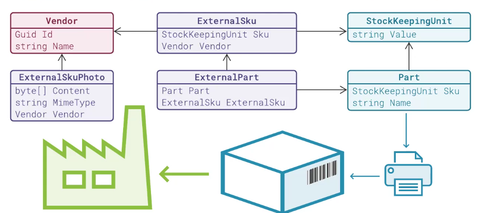
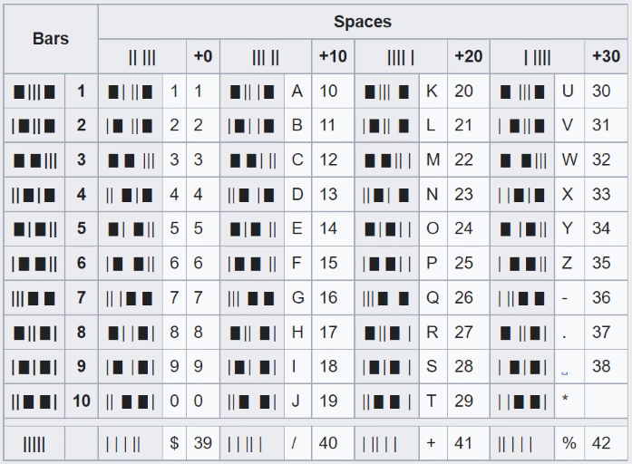
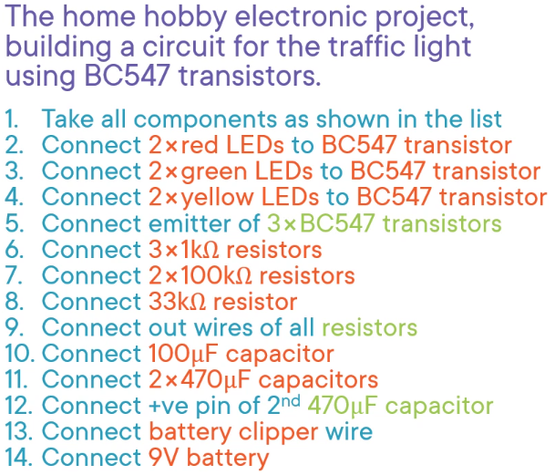

### Model a factory producing hardware devices.

Each device consists of parts.
Each part must have a SKU to be able to be distinguished from other Parts

SKU for the same item may vary per company

We keep record of the vendors SKU so when can better confront the vendor on problems.

In our system we are associating vendors with guids to identity them and a name.

We need to track reception of parts from vendors.

The external SKU must never be printed as Barcode.

Store a photo scan of the external barcode/QR code.

Possible Future Areas of the System

* Materials: Parts, materials, elements...
* Warehouse: Stockkeeping of parts, materials..
* Assembly: Specifications, blueprints, assembly instructions..
* Finance: Tracking money, costs, procurement
* Transport: ...
* Planning: ...
* Units: ...

Technical Requirement:
* Draw a barcode from the SKU
* Support visual style parameters
* Make no observable side effects
* Support nondestructive mutation in custom classes

* Parameterize barcode printing:
  * Bar thicknesses, gaps, antialiasing
  * Image height, margins

Support assembly aspecifications
* Parts are built into a device
* Materials are spent in the process
Specification
* A list of instructions
* Each instruction is a block of text consisting of
    * plaintext
    * new parts
    * part mentions (already used in previous instruction)
* Support different display for multiple vs. single part
Only display specifications that can built from items currently available in the inventory

Example for Type problem:
* Part: Name="BC547", SKU="ELTRBC547"
  * There is no such thing as dividing a part into two 
* Material: Name="Soldering alloy ingot", SKU="SLD10"
  * Dividing a material results in portions that retain the qualities of the original material.

